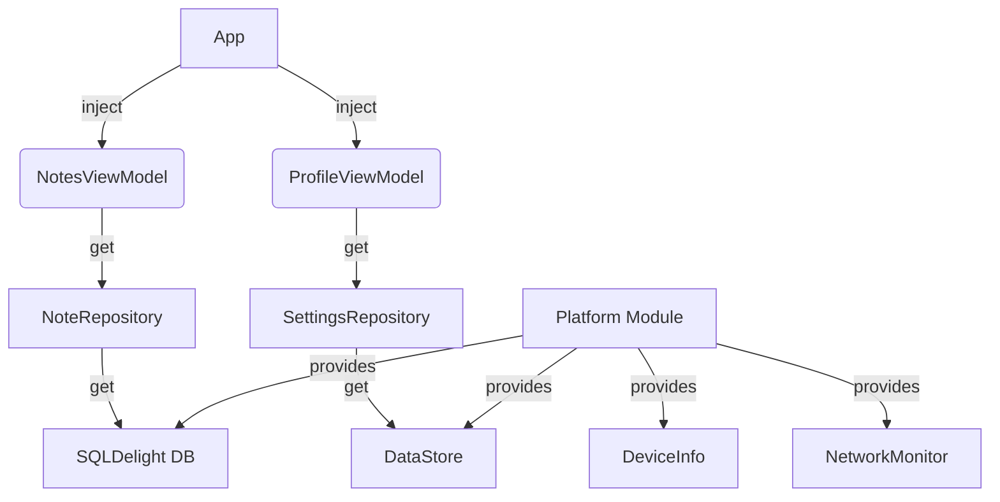

# MyProfile & Notes App - Platform Edition (Week 8 Upgrade)

Aplikasi manajemen catatan modern yang ditingkatkan dengan fitur spesifik platform dan arsitektur Dependency Injection yang solid.

## 🚀 Fitur Baru (Tugas 8 - Koin & Platform Features)

- **Koin Dependency Injection**: 
  - Implementasi DI menyeluruh untuk mengelola siklus hidup repository, ViewModels, dan platform-specific drivers.
  - Penggunaan `koinViewModel` untuk pengambilan ViewModel secara otomatis.
- **DeviceInfo (Platform Specific)**:
  - Menggunakan pola `expect/actual` untuk mengambil informasi perangkat.
  - Menampilkan Model Perangkat dan Versi OS di layar **Settings**.
- **Network Monitoring**:
  - Implementasi pemantauan status koneksi internet secara real-time.
  - Indikator **"Sedang Offline"** yang muncul secara dinamis di layar utama saat koneksi terputus.
- **Refined Modern UI**: 
  - Header profil premium dengan gradien.
  - Staggered grid untuk catatan.

## 🏗️ Diagram Arsitektur (DI)

## 📱 Fitur Spesifik Platform
| Fitur | Android | Desktop (JVM) |
| --- | --- | --- |
| **Database** | AndroidSqliteDriver | JdbcSqliteDriver |
| **Settings** | PreferenceDataStore (File) | PreferenceDataStore (Local) |
| **DeviceInfo** | Build.MODEL & SDK_INT | System.getProperty |
| **Network** | ConnectivityManager Callback | Flow Constant (Mock) |

## 🛠️ Teknologi Tambahan
- **DI Framework**: Koin 3.6.0-Beta4
- **Koin Compose**: 1.2.0-Beta4
- **Platform APIs**: Android ConnectivityManager

## 🏃 Cara Menjalankan
1.  Buka project di **Android Studio**.
2.  Lakukan **Gradle Sync** untuk mengunduh library Koin.
3.  Jalankan di emulator. 
4.  Coba matikan WiFi/Data untuk melihat indikator **Offline** di layar Notes.
5.  Masuk ke **Profile -> Settings** untuk melihat informasi perangkat Anda.

---
*Tugas 8 - Pengembangan Aplikasi Mobile (PAM) RA.*
